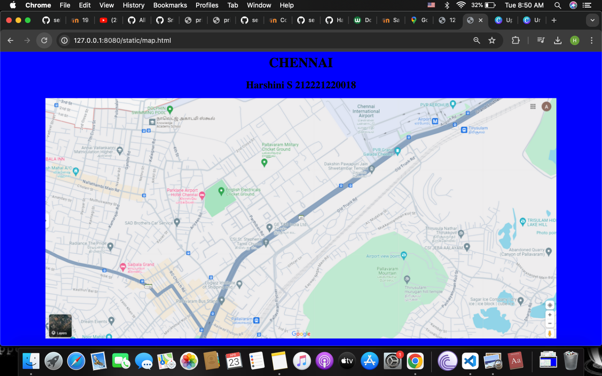

# Ex04 Places Around Me

## Date: 05.03.2024

## AIM
To develop a website to display details about the places around my house.

## DESIGN STEPS

### STEP 1
Create a Django admin interface.

### STEP 2
Download your city map from Google.

### STEP 3
Using ```<map>``` tag name the map.

### STEP 4
Create clickable regions in the image using ```<area>``` tag.

### STEP 5
Write HTML programs for all the regions identified.

### STEP 6
Execute the programs and publish them.

## CODE

``` 
map.html

<html>
<head>
    <title>My City</title>
</head>
<body bgcolor="blue">
 <h1><center>CHENNAI</center></h1>
 <h2><center>Harshini S 212221220018</center></h2>
<center></center>

<map name="MyCity">
    <area target="" alt="DOLPHINE SWIMMING POOL" title="DOLPHINE SWIMMING POOL" href="swim.html" coords="417,59,69" shape="circle">
    <area target="" alt="Chennai International Airport" title="Chennai International Airport" href="airport.html" coords="1280,32,195" shape="circle">
    <area target="" alt="Pallavaram Military Cricket Ground" title="Pallavaram Military Cricket Ground" href="cricket.html" coords="815,264,84" shape="circle">
    <area target="" alt="Pallavaram Mountain" title="Pallavaram Mountain" href="mountain.html" coords="1252,684,143" shape="circle">
    <area target="" alt="CSI St.Stephen's Church" title="CSI St.Stephen's Church" href="Church.html" coords="815,552,64" shape="circle">
</map>
</body>
</html>
```
```
swim.html

<html>
<head>
    <title>
        SWIMMING
    </title></head>
<body bgcolor="red">
    <h1><center> CHENNAI </center></h1>
    <h2><center> Dolphine Swimming Pool </center></h2>
    <hr>
    <center><h3>The Dolphin Swimming Pools is renowned not only for exceptional pool designs but also for that creates a welcoming atmosphere.<br> Beyond a pool service, it's a hub of creativity and leisure, fostering a community that values elegance and rejuvenation.</h3></center>
</body>
</html>
```
```
mountain.html

<html>
<head>
    <title>
        MOUNTAIN
    </title></head>
<body bgcolor="aqua">
    <h1><center> CHENNAI </center></h1>
    <h2><center>Pallavaram Mountain</center></h2>
    <hr>
    <center><h3>Pallavaram is considered to be one of the oldest inhabited places in South India.<br> A major archaeological find was made in the year 1863 when the British archaeologist Robert Bruce Foote discovered a stone implement from the Paleolithic Age inside a ballast pit.</h3></center>
</body>
</html>
```
```
cricket.html

<html>
<head>
    <title>
        CRICKET
    </title></head>
<body bgcolor="yellow">
    <h1><center> CHENNAI </center></h1>
    <h2><center>Pallavaram Military Cricket Ground</center></h2>
    <hr>
    <center><h3>A cricket field or cricket oval is a large grass field on which the game of cricket is played.<br> Although generally oval in shape, there is a wide variety within this: perfect circles, elongated ovals, rounded rectangles, or irregular shapes with little or no symmetry – but they will have smooth boundaries without sharp corners, almost without exception.</h3></center>
</body>
</html>
```
```
airport.html

<html>
<head>
    <title>
        AIRPORT
    </title></head>
<body bgcolor="orange">
    <h1><center> CHENNAI </center></h1>
    <h2><center> Chennai International Airport </center></h2>
    <hr>
    <center><h3>Chennai International Airport is an international airport serving the city of Chennai, the capital of Tamil Nadu, India and its metropolitan area.<br> It is located in Tirusulam, around 20 km southwest of the city centre.<br> The airport is the 5th busiest airport in India, and 3rd by international traffic.</h3></center>
</body>
</html>
```
```
Church.html

<html>
<head>
    <title>
        CHURCH
    </title></head>
<body bgcolor="indigo">
    <h1><center> CHENNAI </center></h1>
    <h2><center>CSI St.Stephen's Church</center></h2>
    <hr>
    <center><h3> St. Stephen the first martyr of Christianity, in whose name our church is named, was a deacon in the early church at Jerusalem, who aroused the enmity of members of various synagogues by his teachings.</h3></center>
</body>
</html>
```

## OUTPUT


## RESULT
The program for implementing image maps using HTML is executed successfully.
